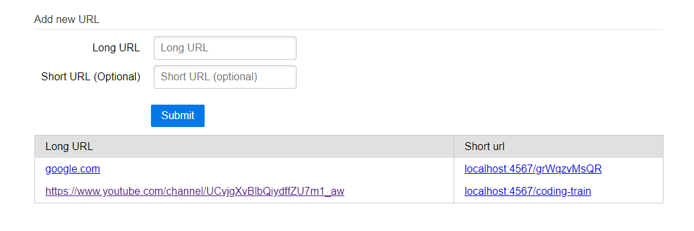

# What is it?
A simple selfhosted URL shortener with no name because naming is hard

## But why another URL shortener?
I've looked at a couple popular URL shorteners, however they either have
unnecessary features, or they didn't have all the features I wanted.

# Features
- Shortens URLs of any length to a fixed length, randomly generated string
- (Optional) Allows you to specify the shortened URL instead of the generated
  one (Missing in a surprising number of alternatives)
- Opening the fixed length URL in your browser will instantly redirect you
  to the correct long URL (you'd think that's a standard feature, but
  apparently it's not)
- Provides a simple API for adding new short links
- Links are stored in a plaintext CSV file
- Available as a Docker container (there is no image on docker hub _yet_)
- Backend written in Java using [Spark Java](http://sparkjava.com/), frontend
  written in plain HTML and vanilla JS, using [Pure CSS](https://purecss.io/)
  for styling

# Screenshot


# Planned features for 1.0 (in order of importance
- Some form of authentication
- Input validation (on client and server)
- Deleting links using API and frontend
- Better deduplication
- Code cleanup
- An actual name
- Official Docker Hub image

# Usage
Clone this repository
```
git clone https://github.com/draganczukp/url
```
## Building from source
Gradle 6.x.x and JDK 11 are required. Other versions are not tested
### 1. Build the `.jar` file
```
gradle build --no-daemon
```
The `--no-daemon` option means that gradle should exit as soon as the build is
finished. Without it, gradle would still be running in the background
in order to speed up future builds.

### 2. Set environment variables
```bash
export username=<api username>
export password=<api password>
export file.location=<file location> # opitonal
```

### 3. Run it
```
java -jar build/libs/url.jar
```
### 4. Navigate to `http://localhost:4567` in your browser, add links as you wish.

## Running with docker
### `docker run` method
1. Build the image
```
docker build . -t url:1.0
```
2. Run the image
```
docker run -p 4567:4567 -d url:1.0 
```
2.a Make the CSV file available to host
```
touch ./urls.csv
docker run -p 4567:4567 \
	-e file.location=/urls.csv \
    -e username="username"
    -e password="password"
	-v ./urls.csv:/urls.csv \
	-d url:1.0
```
## `docker-compose`
There is a sample `docker-compose.yml` file in this repository. You can use it
as a base, modifying it as needed. Run it with
```
docker-compose up -d --build
```
